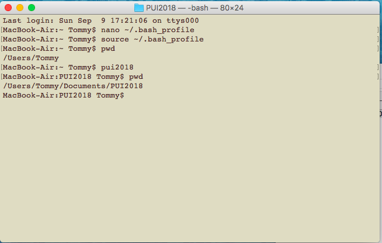

# PUI 2018 HW #2
This is the description of how I set up my environment in HW assignment #1.

## Setting up the environment

I performed the following steps in order to set up my environment as required for assignment #1:

1. I created the directory PUI2018 on my local computer.
2. I opened the .bash_profile using the nano text editor in order to insert my environmental variable
3. I used the export and alias functions in order to establish my $PUI2018 environmental variable, such that typing pui2018 in the terminal brought me to my PUI2018 directory.

Following are screenshots showing my terminal commands and .bash_profile edits.

## Screenshots

Screenshot 1

Showing the .bash_profile

Screenshot 2

Showing the terminal commands
