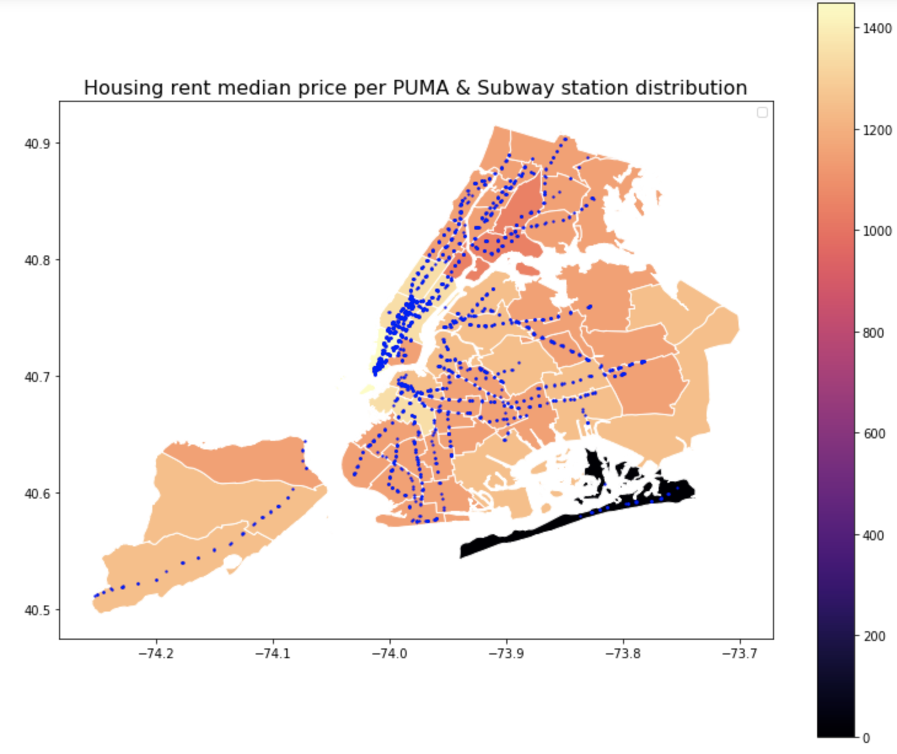

  

**CLARITY**:  
The plot is clear. There are no extra confusing elements. Each element of the plot is applicable and clear.

**ESTHETIC**:  
The estethic of the plot is ok but could be improved (see IMPROVEMENTS). The color usage is utilized well for the subway stations but color usage for the rental housing price does not add significantly to the understanding of the plot. The layout of the plot is functional and shows all of the data well.

**HONESTY**:  
The plot is honest and does not appear to deform the data. The inclusion of a caption is very good and the caption does a good job describing what the plot is showing and what the apparent trends are.

**IMPROVEMENTS**:  
There are a few improvements I would suggest, listed below in bullet form:
- Include a legend
- Units for price would be helpful. I am assuming dollars but that is not clear without specifiying units.
- Since axes are included, axis labels and units should be included
- In the caption, there is mention of the suburbs, but it is unclear which suburbs. Does this mean one of the boroughs? And if so, which borough?
- The color scale could have been shown differently for the median rental housing price, because for most of NYC (with the exception of Rockaway beach), most of the colors are close to each other in shade. Perhaps Rockaway Beach could have had a color and the rest of NYC could have had it's own color scale to allow more variation in the shades of colors. 